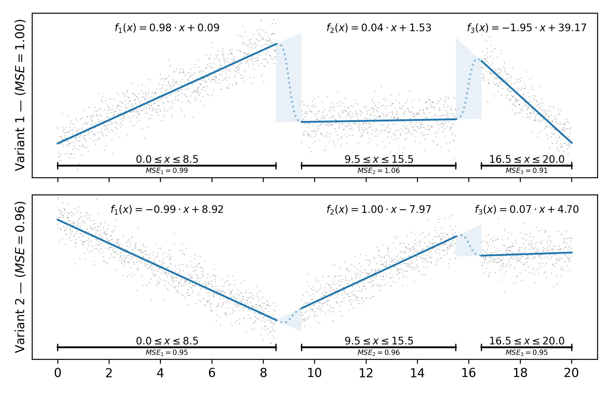

# Multi-Variant Segmented Regression

This library enables segmented regression, calculating a suitable piecewise function which minimizes the MSE to the input samples.

To use this library, refer to a [supported programming language](#installation-and-usage) of your choice.

If you use this library in an academic paper (e.g. to analyze your data), please consider [citing our work](#license-and-contribution).

[ `lang/python/examples/plot.py`](lang/python/examples/plot.py)

## Overview

This library enables segmented regression (also referred to as piecewise regression or min-ε regression).
It generates a segmented regression function, based on models and input samples.
The input samples consist of (typically noise-free) independent variables (x) and noisy, dependent variables (y).

Contrary to other approaches, we do not only try to minimize the average prediction error, but also aim to accurately place the correct breakpoints (i.e. the start and end positions of the individual segments).
This enables qualitative analysis of the breakpoints itself and can show at which exact points the behavior of the underlying data distribution changes, which is especially useful for time-series analysis.

The library is accurate and very fast, enabling the analysis of millions of samples in less than a second on a typical computer.

## Features

The following features are actively supported by this library:

- Determine the Breakpoint-Positions, Minimizing the MSE:
  1. Fast and Accurate Heuristic ($n\log{n}$ Runtime, Results Equal or **Very Close** to the Optimal Solution)
  2. Exact Solution (Dynamic Program, $n^2$ Runtime, Guaranteed Minimal MSE Possible)
- Calculation of the Function-Models and Errors
- Automatically Deduce the Number of Segments
- Multiple Input Dimensions
- Multiple Variants (i.e. Output Dimensions)

Multi-variant segmented regression significantly differs to typical regression.
When using multi-variant operation, the output functions for each variant will share the breakpoint positions.
If the individual regression functions of the variants should not share the breakpoint positions, we recommend conducting an individual single-variant regression for each variant.

## Installation and Usage

While the algorithms are implemented in C++, the interface is exposed via a C-API and there are bindings for other languages.
We aim to make these available as a package in the corresponding package managers.
The exact usage differs between the languages.
We currently support the following languages (see the individual documentation for usage instructions):

- [C](lang/c/README.md)
- [C++](lang/cpp/README.md)
- [Python](lang/python/README.md)
<!-- [Julia](lang/julia/README.md)-->
<!-- [R/Rlang](lang/rlang/README.md)-->
<!-- [Rust](lang/rust/README.md)-->

## License and Contribution

The whole project is licensed under Mozilla Public License (MPL 2.0). This enables everyone to use, link and share this work (see [LICENSE](LICENSE)).
We strongly encourage you to share any changes and contribute to this project directly.

If you are publishing a paper and use this library (e.g. to analyze your data), please consider to cite the following papers.
They describe the analysis algorithm in more detail and evaluate the resulting speed and accuracy.

```bibtex
@InProceedings{pmlr-v267-losser25a,
  title =     {Fast Min-$ε$ Segmented Regression using Constant-Time Segment Merging},
  author =    {L\"{o}{\ss}er, Ansgar and Schlecht, Max and Schintke, Florian and Witzke, Joel and Weidlich, Matthias and Scheuermann, Bj\"{o}rn},
  booktitle = {Proceedings of the 42nd International Conference on Machine Learning},
  pages =     {40312--40327},
  year =      {2025},
  editor =    {Singh, Aarti and Fazel, Maryam and Hsu, Daniel and Lacoste-Julien, Simon and Berkenkamp, Felix and Maharaj, Tegan and Wagstaff, Kiri and Zhu, Jerry},
  volume =    {267},
  series =    {Proceedings of Machine Learning Research},
  month =     {13--19 Jul},
  publisher = {PMLR},
  pdf =       {https://raw.githubusercontent.com/mlresearch/v267/main/assets/losser25a/losser25a.pdf},
  url =       {https://proceedings.mlr.press/v267/losser25a.html},
}
```

<!--end-docs-->
## Thanks

Special thanks for supporting this work goes to:

- [SFB-FONDA](https://fonda.hu-berlin.de/) (Collaborative Research Center CRC-1404)
- [DFG](https://www.dfg.de/en) (German Research Foundation)
- [Technical University of Darmstadt](https://www.tu-darmstadt.de/index.en.jsp)
