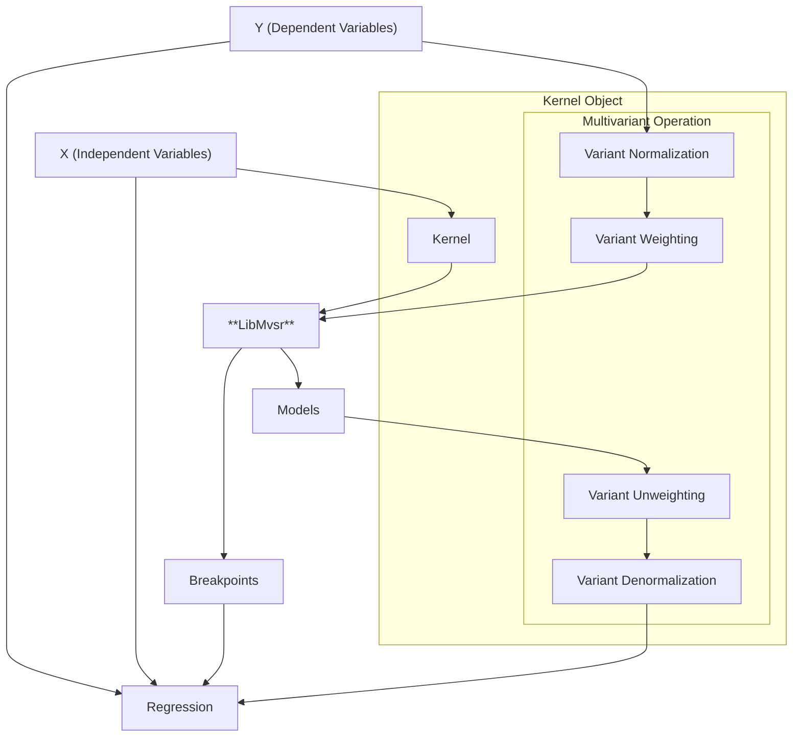

# Python API

<!--hide-in-docs-->
This describes the Python API of the MVSR-project. Consider reading the [general documentation](../../README.md).

## Installation

## Usage

### Advanced Usage

<!--replace-in-docs ### [API Reference](project:./api-reference.rst) -->
### [API Reference](https://loesgar.github.io/msvr/python/api-reference)

### Internals

Data Preprocessing:

## Interpolation

Test text
