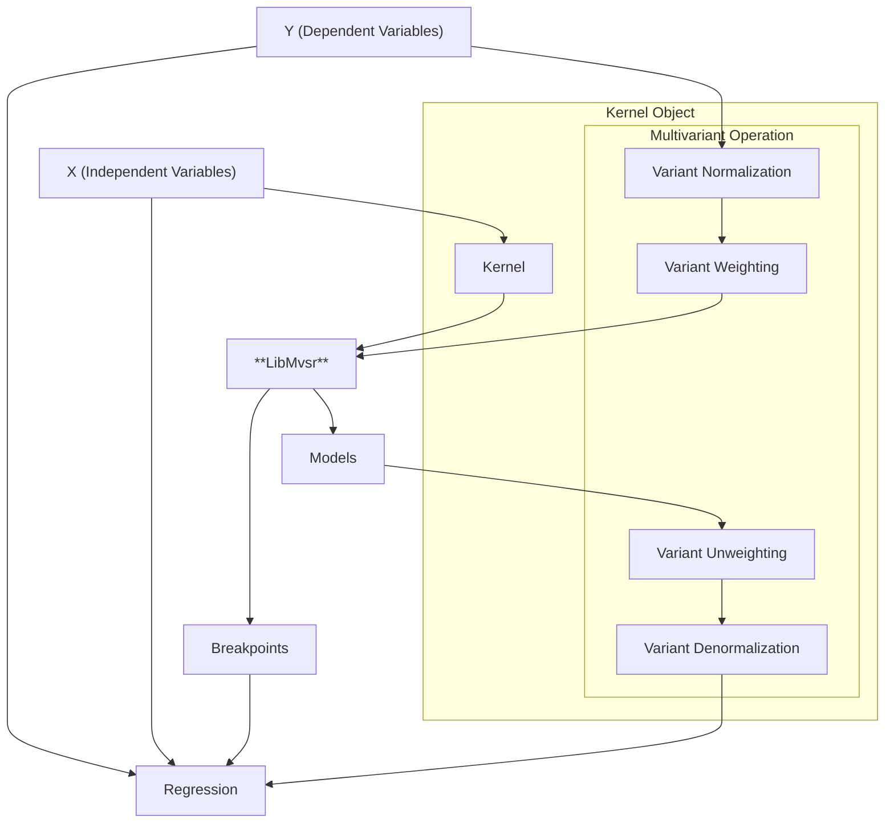

# Python (MVSR)

This describes the python version of the MVSR-project. Consider reading the [general documentaion](../../README.md).

## Installation

## Usage

### Special Use-Cases

### Internals

Data Preprocessing:

## Interpolation

Test text
